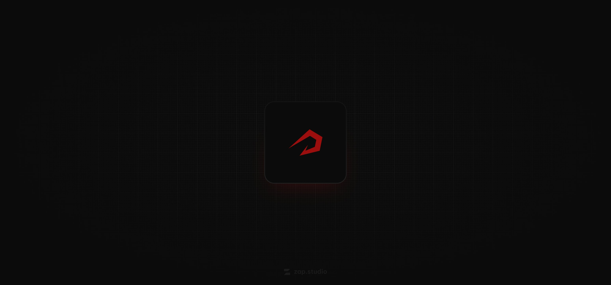

<h1 style="border: none !important;">crimson :: real-time platform</h1>

Crimson is a lightweight platform for real-time communication with  coworkers and centralized storage of company information and ongoing projects.

 
 
 
 
 

## Techstack

Crimson is built to be lightweight, fast, easily extendable and written in minimalistic code.

Powered by:

- [pocketbase](https://pocketbase.io)
- [tauri](https://tauri.app/)
- [react](https://react.dev/)
